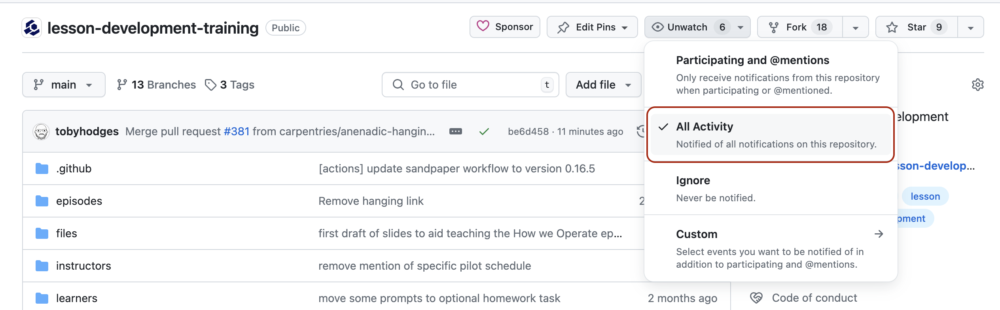

:::::::::::::::::::::::::::::::::::::: questions

- Q1
- Q2
- Q3

::::::::::::::::::::::::::::::::::::::::::::::::

::::::::::::::::::::::::::::::::::::: objectives

After following this section, participants will be able to:

- manage GitHub notifications to receive relevant updates about activity on their repository.
- choose a routine and channels for working with collaborators on the project.

::::::::::::::::::::::::::::::::::::::::::::::::

## Staying in the Loop
GitHub provides a useful notification feature for collaborative work - _mentions_.
The mention system notifies team members when somebody else references them in an issue, comment or pull request.
You can use this to notify people when you want to check a detail with them, or let them know something has been fixed or changed (much easier than writing out all the same information again in an email!).
In repositories belonging to an _organisation_ rather than an individual user, _Teams_ of users can be created and mentioned collectively, sending a notification to all its individual members.

Typing `@` in GitHub will bring up a list of all accounts and teams linked to the repository that can be "mentioned". You can also mention people who aren't linked with the repository but they won't be listed in the `@` drop-down list so you will need to know their GitHub username in order to mention them.

### When Will I Be Notifed?
By default, a user will be notified when they are mentioned, assigned an issue, asked to review something, and when some activity occurs on an issue or pull request that they opened or commented on previously.
These settings can be adjusted for individual projects via a dropdown on the landing page of the repository. 

{
alt="GitHub's different notification settings when watching repository events with 'All Activity' highlighted"
}

You can choose to ignore a project, meaning that GitHub will never notify you about activity on that repository even if you are mentioned directly.
Or you might prefer to "watch" the project, receiving updates on any activity on the repository e.g. whenever somebody opens a new issue or pull request, or comments on an existing one.
There is also the option to customise notifications further.

#### How Will I Be Notified?
In the settings for your GitHub account, you can also choose where these notifications will appear.
GitHub can send you emails to multiple addresses or add notifications to [an "inbox" page](https://github.com/notifications) in the GitHub web interface.
You can configure where you want different kinds of notifications to be sent, and even customise these settings from project to project.

:::::::::::::::::::::::::::::::::::::::::: spoiler

#### Managing GitHub Notifications
If you work on multiple projects, or the projects you follow on GitHub are particularly active, the volume of notifications you receive can quickly become overwhelming.
Here are some approaches you can take to help you stay on top of things, and distinguish the high-priority tasks and important updates from the regular traffic.

##### Email Notifications
If you want to filter, organise, and redirect email notifications from GitHub,
here are some characteristics of the messages that you make use of:

- All GitHub notifications are sent from the address `notifications@github.com`.
- Notification emails are sent to the address `repo-name@noreply.github.com`, where `repo-name` is the name of the repository where the notification was triggered.
- The email subject begins with `[org-or-user/repo-name]`, where `org-or-user` is the name of the organisation or the username of the user who owns the repository and `repo-name` is the name of the repository where the notification was triggered.
- In addition to your email address, the cc field of the message contains an address that describes the type of event that triggered the notification.
  - `author@noreply.github.com` for activity on an issue or pull request that you opened.
  - `mention@noreply.github.com` for a mention of your username.
  - `team-mention@noreply.github.com` for a mention of a team you are a member of.
- The email header (metadata) includes a `mailing-list` field with an identifier in the form `repo-name.org-or-user.github.com`, which can be used to filter by the project and/or its owner.

[GitHub provides detailed documentation about all of the properties you can use to filter their notification emails](https://docs.github.com/en/account-and-profile/managing-subscriptions-and-notifications-on-github/setting-up-notifications/configuring-notifications#filtering-email-notifications).

Most email clients provide configuration for rules that can be set to redirect messages to particular folders, and/or to annotate them with a mark or flag, based on this kind of information. 
[Here is the documentation for setting such rules in Gmail](https://support.google.com/mail/answer/6579?hl=en).

##### Notifications on GitHub.com
The GitHub notifications inbox page includes several preconfigured filters:

- group notifications by repository.
- see notifications for a particular repository.
- see particular types of notification e.g. mentions, issue assignments, etc.

You can also create your own, more sophisticated filters, using the search bar, e.g. all mentions for all repositories in a particular organisation.

::::::::::::::::::::::::::::::::::::::::::::::::::

Whatever strategy you choose, one of the most important habits that will help you stay on top of your projects and tasks is to remember to check these notifications frequently.

## Working Together

### Talking to Each Other
In addition to tracking and responding to activity on your repository, effective teams typically maintain other channels of communication.
These channels can be useful for more informal communication and back-and-forth discussion that is less suitable for a public discussion thread on GitHub.

[Slack](https://slack.com/) is commonly used in the Carpentries community for quick, day-to-day message exchange among community members and staff.
You should [join the Carpentries Slack workspace](https://slack-invite.carpentries.org/) in particular to connect with other lesson developers.
Once you join, you can create a channel for your lesson development project under [the Carpentries public Slack workspace](https://carpentries.slack.com/).
If you need more complex team communications (e.g. multiple channels) you can create your own [Slack workspace](https://slack.com/intl/en-gb/).
Workspaces can be created for free but carry some restrictions e.g. on message volume and history, and file storage.
The Carpentries Slack is an enterprise workspace and is not subject to these limits.

Collaborators may also choose other platforms to discuss lesson development or receive contributions from newcomers who are not yet fluent in using GitHub's systems of communication. 
The Carpentries can assist with creating a mailing list specific to the development of your lesson on their [TopicBox](https://carpentries.topicbox.com/) platform for managing threaded email discussions. 
Also make sure to join the [Incubator lesson developers mailing list](https://carpentries.topicbox.com/groups/incubator-developers) on TopicBox to keep an eye on announcements and discussions relating to lesson development in general within the Carpentries community.

### Making Progress

The following practices have been shown to help maintain steady progress with lesson development:

  - being responsive to notifications about activities and mentions
  - scheduling regular co-working/[sprinting](learners/reference.md#glossary) sessions with team members (e.g attaching your sprint sessions to other open source community activities, which may offer goodies, rewards and prizes for participants, can provide motivation and activity spikes)
  - working alongside other members of The Carpentries community at Maintainer or lesson development co-working sessions
  - blocking time in your calendar for issue triage/solo material writing
  - planning lesson pilots in advance to help set targets

:::::::::::::::::::::::::::::::::::::: keypoints

- KP1
- KP2
- KP3

::::::::::::::::::::::::::::::::::::::::::::::::
